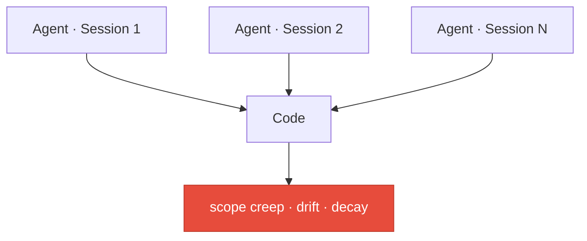
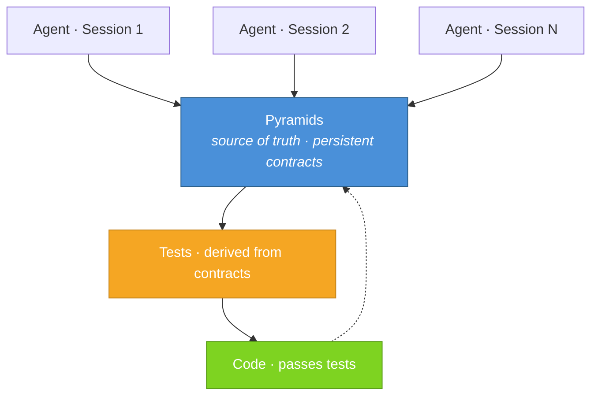

# Pyrs

*Pronounced "pyres," short for pyramids.*

An AI skill plugin for [Claude Code](https://claude.com/claude-code) and [OpenCode](https://opencode.ai) that introduces a structured, hierarchical approach to building software with LLM agents.

## What is Pyrs?

A structured contract layer that keeps AI coding agents aligned with your architecture as projects scale. Prevents scope creep, conceptual drift, and the silent architectural decay that happens when agents build without durable context.

**Without Pyrs** — no matter how thorough your planning phase is, context doesn't survive the session:



**With Pyrs** — pyramids persist across sessions, drive tests, tests drive code:



Pyrs is a double acronym, one for what it does, and one for the artifact it produces: 

**P**yramids **Y**ielding **R**eliable Software  
**P**yramidal **Y**ield-**R**eady **S**pecifications

Created by [Zach Button](https://linkedin.com/in/zachbutton/)

## The Problem

LLM coding agents are powerful, but they have a fundamental limitation: they lack durable, structured understanding of the system they're building. Each conversation starts fresh. Context windows are finite. And the bigger a project gets, the harder it is for an agent to hold the full picture in its head.

This leads to predictable failure modes:

- **Scope creep** — an agent implementing one feature quietly introduces behavior that belongs somewhere else, or that was never asked for
- **Conceptual drift** — as features are added over time, the system's architecture silently diverges from what was intended, and nobody notices until it's a mess
- **Fragile alignment** — the only source of truth is the code itself, but code doesn't explain *why* it exists, what contracts it upholds, or how its pieces relate to each other

Documentation helps, but traditional docs tend to either mirror the code (redundant) or describe aspirational architecture (stale). Neither serves as a reliable bridge between human intent and agent execution.

## The Philosophy

The pyramid workflow is built on a few core ideas:

**Concepts, not code.** Pyramids describe *what* a system does and *why*, never *how*. They define contracts, relationships, and boundaries — not implementations. Code is free to change; concepts are stable. When a pyramid says "messages are delivered at-least-once," the implementation can use a queue, a database, a carrier pigeon — the pyramid doesn't care. It only cares that the contract holds.

**Hierarchy mirrors decomposition.** Software is naturally hierarchical — systems decompose into subsystems, which decompose into components. Pyramids mirror this. The root is the broadest overview. Each level down gets more specific. A parent pyramid owns the contract of how its children relate to each other, while each child owns the contract of what it does internally. This means an agent implementing one piece can understand exactly its scope — and nothing more.

**Strict scoping prevents contamination.** When an agent implements pyramid P, it implements *only* P. Not the parent. Not the children. Not "helpful extras." If a child pyramid doesn't exist yet, the agent leaves an explicit placeholder and moves on. This is enforced — audits will catch scope violations. The result is that each piece of the system is built in isolation against a clear specification, and the specification itself is what ensures the pieces fit together.

**Audits close the loop.** Pyramids aren't static documents that get written and forgotten. The workflow includes explicit audit and review commands that check pyramids against each other (conceptual alignment) and against the code (implementation alignment). Drift is caught, surfaced, and reconciled through conversation with the developer. The system stays honest over time.

**The developer stays in control.** Pyramid commands don't silently make sweeping changes. When drift is found, the agent asks probing questions. When a new pyramid doesn't fit cleanly into the hierarchy, the agent surfaces the tension and asks how to resolve it. The workflow is opinionated about structure but collaborative about decisions.

## How It Works

### The Pyramid Directory

A project using the pyramid workflow has a `./pyramids/` directory at its root. This directory contains `.md` files organized in a hierarchy that mirrors the conceptual structure of the product:

```
pyramids/
├── index.md                    # Broadest product overview
├── auth/
│   ├── index.md                # Auth concept overview
│   ├── session-management.md   # Small, self-contained concept
│   └── oauth/
│       └── index.md            # Deeper nested concept
└── event-bus.md                # Small top-level concept
```

- `./pyramids/index.md` is the root — the broadest overview of what the product is and what its major pieces are
- Concepts with children get a directory with an `index.md` (e.g., `./pyramids/auth/index.md`)
- Small, self-contained concepts get a single file (e.g., `./pyramids/event-bus.md`)
- Nesting is recursive — deeper levels are more granular, but every level remains high-level and conceptual
- Parent pyramids reference their children, and children reference their parent — orphans (unreferenced pyramids) are treated as errors

### Pyramid File Structure

Every pyramid file contains these sections:

| Section | What it captures |
|---------|-----------------|
| **Purpose** | What the concept is and why it exists |
| **Concepts** | Key ideas and behaviors, described in plain language |
| **Contracts** | Behavioral guarantees and invariants — what must be true |
| **Relationships** | Explicit links to parent and child pyramids, plus See Also cross-references to related concepts |
| **Constraints** | Boundaries and prohibitions — what this concept must NOT do |

Pyramids may include abstract code snippets to illustrate a concept, but these are never prescriptive. The real implementation does not need to resemble example code — it only needs to uphold the contracts and respect the constraints.

**When does a concept need its own pyramid?** When it has contracts that can be violated independently. If a behavior is just a detail of a parent's contract, it belongs in the parent. If it has its own guarantees, boundaries, or relationships — things an agent could get wrong in isolation — it's a pyramid.

### Pyramid Identifiers

Commands reference pyramids using dot-delimited identifiers that resolve to file paths:

- `event-bus` → `./pyramids/event-bus.md` or `./pyramids/event-bus/index.md`
- `event-bus.actions` → `./pyramids/event-bus/actions.md` or `./pyramids/event-bus/actions/index.md`
- `root` → `./pyramids/index.md` — use this when you want to target the top-level pyramid itself (e.g., `::audit root::`)
- `root` is optional as a prefix — `root.event-bus.actions` and `event-bus.actions` resolve to the same pyramid, so you can omit it

### Commands

Commands are issued in conversation using `::command context::` syntax (two colons on each side). `P` is a pyramid identifier in dot notation (e.g., `task-queue.retry`). `P?` means the identifier is optional.

| Command | What it does |
|---------|-------------|
| `::new P? [...description]::` | Create a new pyramid, fitting it into the hierarchy with proper parent links |
| `::update P? [...description]::` | Revise an existing pyramid, surfacing downstream impacts |
| `::implement P::` | Build P's concept in code using incremental test-driven development |
| `::tighten P::` | Update existing code to conform to a revised pyramid, also using TDD |
| `::audit P::` | Traverse upward from P, checking conceptual alignment across the hierarchy |
| `::review P::` | Compare actual code against the pyramid(s) it should mirror — P can also be a code path (e.g., `src/queue/`) |
| `::survey P::` | Analyze P and its full lineage (ancestors + descendants) for structural gaps and missing leaves |
| `::post-mortem P? [...description]::` | Debug an issue that should have been impossible given the pyramids, then patch the gap |
| `::ls::` | List the pyramid hierarchy as a tree; `::ls describe::` to include descriptions |
| `::help::` | Show the command reference |

If you describe a code change without using a `::` command, the plugin will intercept and guide you into the pyramid workflow — changes always flow through pyramids.

### Placeholders

When `::implement::` or `::tighten::` encounters an unbuilt dependency — whether a child pyramid or a sibling referenced via See Also — it leaves an explicit placeholder in the code: `// PRYS_TODO: ./pyramids/[path]`. These placeholders include meaningful runtime logging so missing pieces are visible during execution, not silently absent. Once the dependency is created and implemented, the placeholder gets replaced.

### The Audit Loop

The real power of the workflow is the feedback loop between pyramids and code:

1. `::new::` or `::update::` defines or revises a concept
2. `::audit::` ensures the concept fits coherently within the hierarchy
3. `::implement::` or `::tighten::` builds or updates the code to match
4. `::review::` catches drift between code and pyramids over time

This loop keeps the system aligned at every level — from high-level product vision down to individual component behavior — across conversations, across agents, and across time.

## Example Walkthrough

Here's how the pyramid workflow plays out across a real project. Each step below happens in a **fresh session** — separate conversation, different day, even a different agent. The pyramid is the durable context.

---

**Session 1** — Define the concept

```
::new task-queue a task queue that processes background jobs::
```

The agent asks where this fits in the hierarchy, you discuss scope and contracts, and it writes the pyramid.

*Result: `./pyramids/task-queue.md` exists with Purpose, Concepts, Contracts, Relationships, and Constraints.*

---

**Session 2** — Build it *(fresh context)*

```
::implement task-queue::
```

The agent reads `task-queue.md` — that's all it needs. It builds the implementation via incremental TDD. Child concepts referenced but not yet defined get `// PRYS_TODO` placeholders with runtime logging.

---

**Session 3** — Decompose further *(fresh context)*

```
::new task-queue.retry retry logic with exponential backoff::
```

The agent creates `./pyramids/task-queue/retry.md` as a child pyramid and updates the parent to reference it.

---

**Session 4** — Build the child *(fresh context)*

```
::implement task-queue.retry::
```

The agent reads `retry.md`, implements via TDD, and replaces the `PRYS_TODO` placeholder left in Session 2.

---

**Session 5** — Revise *(fresh context)*

```
::update task-queue dead-letter support after max retries::
```

The agent revises `task-queue.md`. It surfaces that this impacts `retry.md` and asks how to reconcile before making changes.

---

**Session 6** — Tighten to match *(fresh context)*

```
::tighten task-queue::
```

Updates existing task-queue code to conform to the revised pyramid via TDD.

---

**Later** — Maintenance *(fresh context)*

```
::review task-queue::
```

Catches drift between code and pyramids.

```
::audit task-queue::
```

Verifies conceptual alignment up the hierarchy.

---

Every session starts cold. The pyramids are the memory.

**In practice:** When something breaks that shouldn't have been possible, `::post-mortem::` traces the failure and patches the pyramid gap — a missing contract, an under-specified constraint, a cross-pyramid interaction nobody accounted for. Then a fresh agent runs `::tighten::` and independently fixes the bug it never saw, because the pyramid now describes the world correctly.

## Source Control

The `./pyramids/` directory should be committed to version control alongside your code. Pyramid changes are changes — treat them like any other commit. The recommended convention is to use a `docs:` prefix for pyramid-only changes (e.g., `docs: add task-queue.retry pyramid`).

## Installation

### Claude Code

From within Claude Code:

```
/plugin marketplace add zachbutton/pyrs
/plugin install pyrs@zachbutton-pyrs
```

### OpenCode

Clone the repo and symlink the skills into your OpenCode skills path:

```sh
git clone https://github.com/zachbutton/pyrs.git ~/.local/share/pyrs

# Symlink each skill
for skill in ~/.local/share/pyrs/skills/pyrs-*/; do
  ln -s "$skill" ~/.config/opencode/skills/$(basename "$skill")
done
```

Or use the Claude-compatible skills path if you prefer:

```sh
for skill in ~/.local/share/pyrs/skills/pyrs-*/; do
  ln -s "$skill" ~/.claude/skills/$(basename "$skill")
done
```
