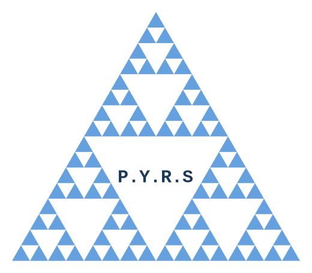
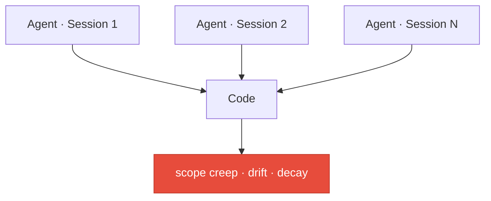
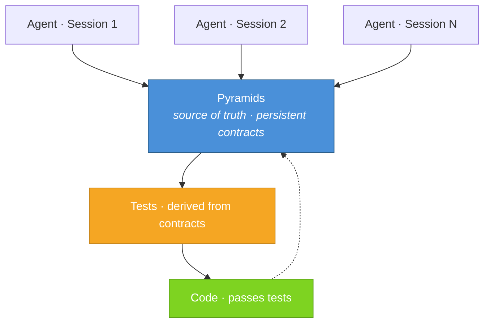

<div align="center">
  
</div>

# PYRS - **P**yramidal **Y**ield-**R**eady **S**pecifications

*Pronounced "pyres," short for pyramids.*

An AI skill plugin for [Claude Code](https://claude.com/claude-code) and [OpenCode](https://opencode.ai) that introduces a structured, hierarchical approach to building software with LLM agents.

> **You:** "Add caching to this service"  
> **Agent:** *rewrites half your architecture*
> 
> *(new session)*
> 
> **You:** "Fix this bug"  
> **Agent:** *ignores caching layer entirely*
>
> *(that ^ doesn't have to be your life anymore!)*

#### ...because this is exactly what PYRS prevents.

## What is PYRS?

Persistent context for AI coding agents. As you work with an agent, PYRS produces simple markdown files ("pyramids") that capture what your system does and why. These pyramids accumulate as a natural byproduct of the conversations you're already having. They're not documentation you maintain; they're artifacts that keep every future agent session aligned with your architecture.

### **Without PYRS** — no matter how thorough your planning phase is, context doesn't survive the session.

You get:
- intent lost across sessions
- architecture slowly mutates
- changes are implicit and fragile



### **With PYRS** — pyramids persist across sessions, drive tests, tests drive code.

You get:
- intent is stored as contracts
- drift is detectable and correctable
- code YOU write can be ingested into the contracts so future agents respect your work



## Table of Contents

- [What is PYRS?](#what-is-pyrs)
- [Installation](#installation)
  - [Claude Code](#claude-code)
  - [OpenCode](#opencode)
- [The Problem](#the-problem)
- [The Philosophy](#the-philosophy)
- [How It Works](#how-it-works)
  - [The Pyramid Directory](#the-pyramid-directory)
  - [Pyramid File Structure](#pyramid-file-structure)
  - [Pyramid Identifiers](#pyramid-identifiers)
  - [Commands](#commands)
  - [Placeholders](#placeholders)
  - [The Audit Loop](#the-audit-loop)
- [Example Walkthrough](#example-walkthrough)
- [Bootstrapping an Existing Project](#bootstrapping-an-existing-project)
- [Adoption Strategies](#adoption-strategies)
  - [Full Coverage (new projects)](#full-coverage-new-projects)
  - [Sparse Coverage (existing projects)](#sparse-coverage-existing-projects)
  - [Meta Pyramid Repos (codebases you don't control)](#meta-pyramid-repos-codebases-you-dont-control)
- [Source Control](#source-control)

## Installation

### Claude Code

From within Claude Code:

```
/plugin marketplace add zachbutton/pyrs
/plugin install pyrs@zachbutton-pyrs
```

### OpenCode

Clone the repo and run the install script. It adds the skills path to your OpenCode config at `~/.config/opencode/config.json`, merging with any existing settings:

```sh
git clone https://github.com/zachbutton/pyrs.git ~/.local/share/pyrs
~/.local/share/pyrs/scripts/install-opencode
```

Or manually add the skills path to your OpenCode config (`opencode.json` in your project root or `~/.config/opencode/config.json`):

```json
{
  "skills": {
    "paths": ["~/.local/share/pyrs/skills"]
  }
}
```

Skills are loaded on demand, not all at once. OpenCode scans the path for `SKILL.md` files and only reads a skill's full instructions when a task matches its description.

## The Problem

LLM coding agents are powerful, but they have a fundamental limitation: they lack durable, structured understanding of the system they're building. Each conversation starts fresh. Context windows are finite. And the bigger a project gets, the harder it is for an agent to hold the full picture in its head.

This leads to predictable failure modes:

- **Scope creep** — an agent implementing one feature quietly introduces behavior that belongs somewhere else, or that was never asked for
- **Conceptual drift** — as features are added over time, the system's architecture silently diverges from what was intended, and nobody notices until it's a mess
- **Fragile alignment** — the only source of truth is the code itself, but code doesn't explain *why* it exists, what contracts it upholds, or how its pieces relate to each other

Documentation helps, but traditional docs tend to either mirror the code (redundant) or describe aspirational architecture (stale). Neither serves as a reliable bridge between human intent and agent execution.

## The Philosophy

The pyramid workflow is built on a few core ideas:

**Concepts, not code.** Pyramids describe *what* a system does and *why*, never *how*. They define contracts, relationships, and boundaries — not implementations. Code is free to change; concepts are stable. When a pyramid says "messages are delivered at-least-once," the implementation can use a queue, a database, a carrier pigeon. The pyramid doesn't care. It only cares that the contract holds.

**Hierarchy mirrors decomposition.** Software is naturally hierarchical: systems decompose into subsystems, which decompose into components. Pyramids mirror this. The root is the broadest overview. Each level down gets more specific. A parent pyramid owns the contract of how its children relate to each other, while each child owns the contract of what it does internally. This means an agent implementing one piece can understand exactly its scope — and nothing more.

**The agent stays focused so you don't have to.** When an agent implements a pyramid, it builds *only* what the pyramid describes. Not the parent. Not the children. Not "helpful extras." If a dependency doesn't exist yet, the agent leaves a placeholder and moves on. You don't have to police scope; the pyramid does that for the agent.

**You can check alignment anytime.** Pyramids aren't static documents that get written and forgotten. Quick audit and review commands let you check how pyramids relate to each other and whether the code still matches. When drift is found, it's surfaced for you to decide what to do. The agent asks, it doesn't assume.

**Commands are just natural language.** The `::command` syntax tells the plugin which strategy to load, but everything inside is conversational. Describe what you want in plain English. There's nothing to memorize; `::help` shows the full list.

**The developer stays in control.** Pyramid commands don't silently make sweeping changes. When drift is found, the agent asks probing questions. When a new pyramid doesn't fit cleanly into the hierarchy, the agent surfaces the tension and asks how to resolve it. The workflow is opinionated about structure but collaborative about decisions.

## How It Works

### The Pyramid Directory

PYRS stores pyramids in a `./pyramids/` directory at the project root. These are plain markdown files organized in a hierarchy that mirrors the conceptual structure of the product:

```
pyramids/
├── index.md                    # Broadest product overview
├── auth/
│   ├── index.md                # Auth concept overview
│   ├── session-management/
│   │   └── index.md            # Leaf concept
│   └── oauth/
│       └── index.md            # Deeper nested concept
└── event-bus/
    └── index.md                # Leaf concept
```

- `./pyramids/index.md` is the root — the broadest overview of what the product is and what its major pieces are
- Every non-root concept uses a directory with an `index.md` (e.g., `./pyramids/auth/index.md`)
- Nesting is recursive; deeper levels are more granular, but every level remains high-level and conceptual
- Parent pyramids reference their children, and children reference their parent. The plugin keeps these links consistent
- `::diff` may write a sibling `diff.md` next to a pyramid `index.md` (e.g., `./pyramids/auth/diff.md`) only when unresolved implementation drift exists; once clean, the sidecar is removed

### Pyramid File Structure

Every pyramid file contains these sections:

| Section | What it captures |
|---------|-----------------|
| **Purpose** | What the concept is and why it exists |
| **Concepts** | Key ideas and behaviors, described in plain language |
| **Contracts** | Behavioral guarantees and invariants — what must be true |
| **Relationships** | Explicit links to parent and child pyramids, plus See Also cross-references to related concepts |
| **Constraints** | Boundaries and prohibitions — what this concept must NOT do |

Pyramids may include abstract code snippets to illustrate a concept, but these are never prescriptive. The real implementation does not need to resemble example code — it only needs to uphold the contracts and respect the constraints.

**When does a concept need its own pyramid?** When it has contracts that can be violated independently. If a behavior is just a detail of a parent's contract, it belongs in the parent. If it has its own guarantees, boundaries, or relationships — things an agent could get wrong in isolation — it's a pyramid.

### Pyramid Identifiers

Commands reference pyramids using `@`-prefixed pyramid references:

- Identifier form:
  - `@event-bus` → `./pyramids/event-bus/index.md`
  - `@event-bus.actions` → `./pyramids/event-bus/actions/index.md`
  - `@root` → `./pyramids/index.md` — use this when you want to target the top-level pyramid itself (e.g., `::sane @root`)
  - `root` is optional inside identifier form — `@root.event-bus.actions` and `@event-bus.actions` resolve to the same pyramid
- Direct-link form:
  - `@./pyramids/event-bus/index.md`
  - `@./pyramids/event-bus/actions/index.md`

### Commands

Commands are issued in conversation using `::command context` syntax (two colons only at the start). Each command loads a specific strategy; the agent handles the rest. `P` is an `@`-prefixed pyramid reference (e.g., `@task-queue.retry` or `@./pyramids/task-queue/retry/index.md`). `P?` means the reference is optional.

| Command | What it does |
|---------|-------------|
| `::` | Make the agent PYRS-aware without performing any operation |
| `::spec P? [...description]` | Create a new pyramid or revise an existing one |
| `::apply P` | Produce or update code from a pyramid using incremental TDD; when a sibling `diff.md` exists for P, refresh that diff target before returning |
| `::sane P` | Traverse upward from P, checking conceptual alignment across the hierarchy |
| `::diff P` | Compare actual code against the pyramid(s) it should mirror and manage per-target `diff.md` sidecars for unresolved gaps — P can also be a code path (e.g., `src/queue/`) |
| `::scan P` | Analyze P and its full lineage (ancestors + descendants) for structural gaps and missing leaves |
| `::mend P? [...description]` | Debug an issue that should have been impossible given the pyramids, then patch the gap |
| `::ingest P? [...description]` | Produce pyramids from existing code — the exception to pyramid-first |
| `::ls` | List the pyramid hierarchy as a tree and call out nodes that have unresolved-gap `diff.md` sidecars; `::ls describe` to include descriptions |
| `::help` | Show the command reference |

You can combine `::` with a question or request to make the agent PYRS-aware before it responds:

```
:: can you explain to me what this repo is for?
:: what does the auth module do and how does it relate to session management?
```

If you describe a code change without using a `::` command, the plugin will gently redirect you into the pyramid workflow. It'll help you figure out which pyramid to create or update first.

### Placeholders

When `::apply` encounters an unbuilt dependency — whether a child pyramid or a sibling referenced via See Also — it leaves an explicit placeholder in the code: `// PYRS_TODO: ./pyramids/[path]`. These placeholders include meaningful runtime logging so missing pieces are visible during execution, not silently absent. Once the dependency is created and applied, the placeholder gets replaced.

### The Audit Loop

The real power of the workflow is the feedback loop between pyramids and code:

1. `::spec` defines or revises a concept
2. `::sane` ensures the concept fits coherently within the hierarchy
3. `::apply` builds or updates the code to match
4. `::diff` catches drift between code and pyramids over time and manages per-target unresolved-gap `diff.md` sidecars

When `::spec`, `::ingest`, `::mend`, or `::apply` modifies a target that already has a sibling `diff.md`, the workflow performs a same-target diff refresh so sidecars stay current (updated if gaps remain, removed when fully reconciled).

This loop keeps the system aligned at every level — from high-level product vision down to individual component behavior — across conversations, across agents, and across time.

## Example Walkthrough

Here's how the pyramid workflow plays out across a real project. Each step below happens in a **fresh session** — separate conversation, different day, even a different agent. Notice that every interaction is a one-liner; the agent does the heavy lifting.

---

**Session 1** — Define the concept

```
::spec @task-queue a task queue that processes background jobs
```

The agent asks where this fits in the hierarchy, you discuss scope and contracts, and it writes the pyramid.

*Result: `./pyramids/task-queue/index.md` exists with Purpose, Concepts, Contracts, Relationships, and Constraints.*

---

**Session 2** — Build it *(fresh context)*

```
::apply @task-queue
```

The agent reads `task-queue/index.md`. That's all it needs. It builds the implementation via incremental TDD. Child concepts referenced but not yet defined get `// PYRS_TODO` placeholders with runtime logging.

---

**Session 3** — Decompose further *(fresh context)*

```
::spec @task-queue.retry retry logic with exponential backoff
```

The agent creates `./pyramids/task-queue/retry/index.md` as a child pyramid and updates the parent to reference it.

---

**Session 4** — Build the child *(fresh context)*

```
::apply @task-queue.retry
```

The agent reads `retry/index.md`, implements via TDD, and replaces the `PYRS_TODO` placeholder left in Session 2.

---

**Session 5** — Revise and apply *(fresh context)*

```
::spec @task-queue dead-letter support after max retries
```

The agent revises `task-queue/index.md`. It surfaces that this impacts `retry/index.md` and asks how to reconcile before making changes.

```
::apply @task-queue
```

Updates existing task-queue code to conform to the revised pyramid via TDD.

---

**Later** — Maintenance *(fresh context)*

```
::diff @task-queue
```

Catches drift between code and pyramids and writes a report to `./pyramids/task-queue/diff.md`.

```
::sane @task-queue
```

Verifies conceptual alignment up the hierarchy.

---

Every session starts cold. The pyramids are the memory.

**In practice:** When something breaks that shouldn't have been possible, `::mend` traces the failure and patches the pyramid gap: a missing contract, an under-specified constraint, a cross-pyramid interaction nobody accounted for. Then a fresh agent runs `::apply` and independently fixes the bug it never saw, because the pyramid now describes the world correctly.

## Bootstrapping an Existing Project

If you have an existing codebase and want to adopt PYRS, `::ingest` reverses the normal flow — it reads code and produces pyramids. This is the exception to the pyramid-first rule.

```
::ingest
```

The agent surveys your codebase, proposes a pyramid hierarchy, and, after your confirmation, writes the pyramids top-down. Each pyramid is conceptual, not a code description. Once ingest is complete, the normal workflow applies: all future changes flow through pyramids.

You can also ingest a specific area:

```
::ingest @auth — focus on session handling and OAuth
```

Or use it after writing code manually, or to re-ingest code that has evolved. Ingest captures the concept so the pyramid artifact exists for future agents:

```
::ingest @task-queue.retry
```

## Adoption Strategies

### Full Coverage (new projects)

When starting a project from scratch, pyramids grow naturally alongside the code. `::spec` before `::apply` becomes the natural rhythm: you describe what you want, the agent writes the pyramid, then builds the code. The pyramids are artifacts of conversations you're already having, not extra work.

### Sparse Coverage (existing projects)

You don't need to ingest your entire codebase. Even a handful of pyramids covering your most drift-prone areas prevents the worst architectural decay. Add them incrementally as you touch areas. `::ingest` what matters, leave the rest. A sparse set of pyramids still gives agents meaningful guardrails in the areas that count.

### Meta Pyramid Repos (codebases you don't control)

If your projects live in `~/code/*`, you can make `~/code/` itself a private repo with its own `./pyramids/` directory. The pyramids describe concepts across multiple codebases — sparse by nature, growing with your understanding of the systems.

This is especially useful at work when your company doesn't use PYRS. Your agents still get durable context across sessions, and as a side effect, `./pyramids/` accumulates tribal knowledge: how systems connect, why things are the way they are, what the gotchas are. That knowledge lives in portable markdown files you can share with your team anytime.

Since you likely don't want `// PYRS:` provenance comments and `// PYRS_TODO:` placeholders showing up in codebases your coworkers maintain, add a constraint to your pyramids:

```markdown
### Constraints
- No PYRS code markers in generated code
```

The skills will respect this and omit all inline markers for that pyramid.

## Source Control

The `./pyramids/` directory should be committed to version control alongside your code. Pyramid changes are changes — treat them like any other commit. The recommended convention is to use a `docs:` prefix for pyramid-only changes (e.g., `docs: add task-queue.retry pyramid`). The same applies to meta pyramid repos: commit pyramids alongside whatever they describe.
